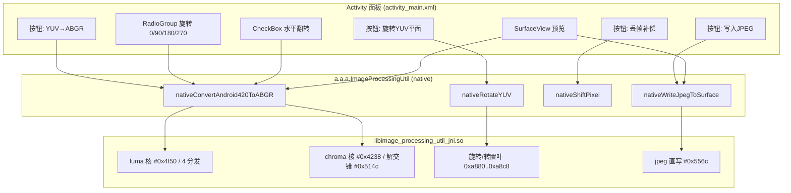

# UI 面板图 (还原)

> 说明: `libimage_processing_util_jni.so` 本身无 UI; UI 在 APK 的 Java 层。
> 下图依据 4 个 JNI 导出函数（`nativeConvertAndroid420ToABGR` / `nativeRotateYUV` /
> `nativeShiftPixel` / `nativeWriteJpegToSurface`）在 `restored_native_v8.c` 中
> 控制的参数集（旋转 0/90/180/270、水平翻转、像素左移、JPEG 直写）反推还原,
> **属功能反推图, 非从 APK 反编译的精确布局**(APK 未提供)。

## ASCII 还原面板
```
┌─────────────────────────────────────────────┐
│  camera-02  (a.a.a)                          │
├─────────────────────────────────────────────┤
│  ┌───────────────────────────────────────┐  │
│  │  SurfaceView 预览/输出 (Surface)        │  │
│  │   convert 写入 / jpeg 直写 的目标        │  │
│  └───────────────────────────────────────┘  │
│  旋转:  (●)0°  ( )90°  ( )180°  ( )270°      │  ← convert: rot
│  ☑ 水平翻转                                  │  ← convert: flip
│  ┌───────────────────────────────────────┐  │
│  │ [YUV→ABGR]  [旋转YUV平面]               │  │  ← convert / rotateYUV
│  │ [丢帧补偿]    [写入JPEG]                 │  │  ← shiftPixel / writeJpeg
│  └───────────────────────────────────────┘  │
└─────────────────────────────────────────────┘
        │                 │                │
        ▼                 ▼                ▼
 nativeConvert…    nativeRotateYUV   nativeShiftPixel / nativeWriteJpegToSurface
 (rot,flip)        (90/180/270)      (pixStride)
```

## Mermaid (构建/调用关系)

